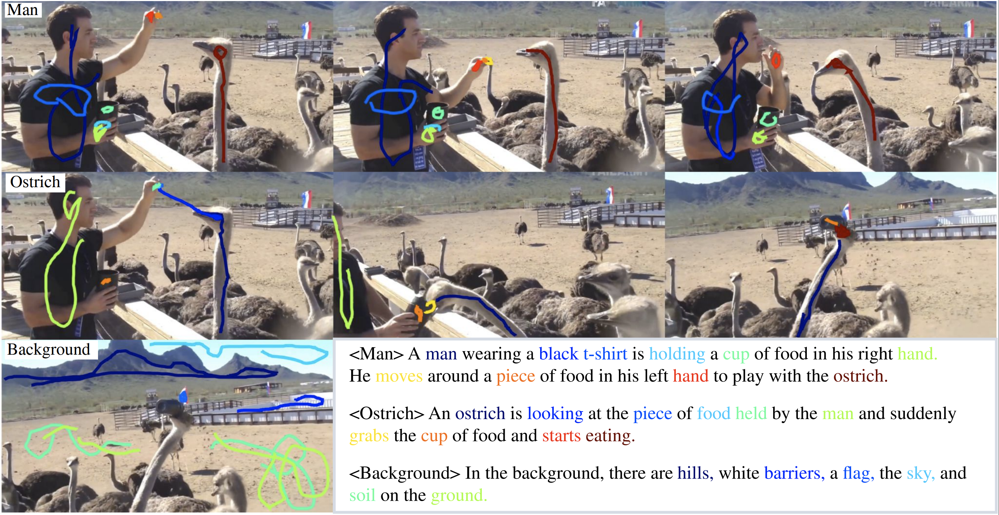

# Video Localized Narratives
Visit the [project page](https://google.github.io/video-localized-narratives) for all the information about Video Localized Narratives, data downloads, data formats, visualizations, and more.

Here we provide the official code for the publication "Connecting Vision and Language with Video Localized Narratives".
The code can be used to load and visualize the Video Localized Narrative (VidLN) annotations.
Additionally, we provide code to evaluate the tasks of Video Narrative Grounding (VNG) and Video Question-Answering (VideoQA) with the sub-tasks of text-output questions and location-output questions. 

##


## Abstract
We propose Video Localized Narratives, a new form of multimodal video annotations connecting vision and language. In the original Localized Narratives, annotators speak and move their mouse simultaneously on an image, thus grounding each word with a mouse trace segment. However, this is challenging on a video. Our new protocol empowers annotators to tell the story of a video with Localized Narratives, capturing even complex events involving multiple actors interacting with each other and with several passive objects. We annotated 20k videos of the OVIS, UVO, and Oops datasets, totalling 1.7M words. Based on this data, we also construct new benchmarks for video narrative grounding and video question-answering tasks, and provide reference results from strong baseline models. Our annotations are available at https://google.github.io/video-localized-narratives/.

## Setup

### Installation
See [install.md](install.md) for how to install the Python dependencies.

If when trying to run the code you get an error like
```
ModuleNotFoundError: No module named 'video_localized_narratives'
```
it most liekly means that you didn't add the video-localized-narratives folder
to your `PYTHONPATH`.

### Data Preparation
See [data_preparation.md](data_preparation.md) for instructions on how to prepare the data.

## Video Localized Narratives (VidLNs)

### Interactive Python Demo
From the video-localized-narratives folder run
```bash
python3 video_localized_narratives/tools/demo.py
```
to see an interactive visualization of sample VidLN annotations.

### HTML Visualizer
To visualize Video Localized Narratives interactively in the web-browser,
open `video-localized-narratives/local_html_vidln_viewer/index.html` with your web-browser.

You will have to select the jsonl file to load and the data root from which the frames, audio files, and video files will be loaded.

For the data root select `video-localized-narratives/data/`.
The web browser will show a message like "This will upload all files from "data". Only do this if you trust this site."
Click on "Upload" here.

Note that this will not actually upload any data, as the whole website runs 
locally on your own PC. However, this is necessary to give the local website
access to the data folder. The data folder has to have the correct folder, i.e.
the same as the sample data supplied in this repository with folders
`frames`, `recordings`, and `videos` (where `videos` and `recordings` are optional)
and in each of these folders a sub-folder with the name of the dataset
(e.g. `OVIS_train`) is expected.

Afterwards, select the VidLN jsonl file, for example `video-localized-narratives/data/vidlns/OVIS_train_sample.json`
Then you should see a visualization of a sample VidLN annotation, you can play
the audio and see how the mouse cursor moves interactively. You can also hover
with the mouse over a word to see the mouse trace for this word.

## Video Narrative Grounding (VNG)
### Interactive Demo
From the video-localized-narratives folder run
```bash
python3 video_localized_narratives/video_narrative_grounding/demo.py
```
to see an interactive visualization of sample VidLN annotations.
Note that for this to work, you first have to download some data (see above).

### Evaluation
You can run the evaluation for VNG like this

```bash
python3 video_localized_narratives/video_narrative_grounding/eval_vng.py --meta_filename=data/vng/OVIS_VNG/meta_expressions/test/meta_expressions.json --extra_masks_filename=data/vng/OVIS_VNG/extra_masks/test/extra_masks.json --orig_masks_filename=data/vng/OVIS_VNG/orig_masks/annotations_train.json --result_folder=/path/to/your/vng_result/
```

The `orig_masks_filename` has to point to the json annotation file of the
original dataset. We do not provide this, you have to download it from the 
websites of the original datasets (OVIS and UVO).
Note that we sub-split the original OVIS training set into a training and a test
set for VNG. For both VNG sub-splits, the `orig_masks_filename` has to point
to the original annotations for the training set.

The folder with results, e.g. `/path/to/your/vng_result/` has to contain
sub-folder for each video, with sub-folders for each expression id, that contain
png files with masks for each frame.

For example, the result for OVIS should look like this
```
/path/to/your/ovis_vng_result/
├── 028f6f64
│   ├── 0
│   │   │── img_0000001.png
│   │   │── ...
│   │   │── img_0000036.png
│   ├── 1
│   │   │── img_0000001.png
│   │   │── ...
│   │   │── img_0000036.png
│   ├── 2
│   │   │── img_0000001.png
│   │   │── ...
│   │   │── img_0000036.png
│   ├── 3
│   │   │── img_0000001.png
│   │   │── ...
│   │   │── img_0000036.png
├── 11e16068
│   ├── 0
│   │   │── img_0000001.png
│   │   │── ...
│   │   │── img_0000067.png
│   │── ...
...
```

And your result for UVO should look like this
```
/path/to/your/uvo_vng_results/
├── 00jZej9_xh8
│   ├── 0
│   │   │── 0.png
│   │   │── ...
│   │   │── 300.png
│   ├── 1
│   │   │── 0.png
│   │   │── ...
│   │   │── 300.png
│   ├── 2
│   │   │── 0.png
│   │   │── ...
│   │   │── 300.png
├── 00MUo_0F9-Q
│   ├── 0
│   │   │── 0.png
│   │   │── ...
│   │   │── 301.png
│   │── ...
...
```


## Video Question-Answering (VideoQA)
Here we explain how to evaluate video question-answering task on the Oops-QA
benchmark. The benchmark is split into the text-output and location-output
tasks. The total score for the Oops-QA benchmark is obtained by averaging the
results for the two sub-tasks.

### Text-output
Evaluate the Oopa-QA text-output task using
```bash
python3 video_localized_narratives/videoqa/text_output/eval_text_output.py --gt_json_path=data/videoqa/text_output/oops_val/qa_text_output.json --results_path=/path/to/your/results.json
```

Where results.json should have the following format:

```
{
  "question_val_0": "black shorts", 
  "question_val_1": "trampoline",
  ...,
  "question_val_12416": "riding",
}
```

### Location-output
Evaluate the Oopa-QA location-output task using
```bash
python3 video_localized_narratives/videoqa/location_output/eval_location_output.py --gt_json_path=data/videoqa/location_output/oops_val/qa_location_output.json --result_folder=/path/to/your/results/
```

In the result folder, e.g. `/path/to/your/results/`, you should have one folder
for each video, which in turn should have one sub-folder for each
`question_hash`, which then contains png files with the predicted masks for
every frame (the structure is very similar to the VNG task).

Your result for the Oops-QA validation set should look like this
```
/path/to/your/results/
├── 34 Funny Kid Nominees - FailArmy Hall Of Fame (May 2017)10
│   ├── 69e69b3a8b29d92dd94be66c79f82d69
│   │   │── 000000.png
│   │   │── ...
│   │   │── 000218.png
├── 34 Funny Kid Nominees - FailArmy Hall Of Fame (May 2017)11
│   ├── 92dcc24e4c843c13fc5f8902a4e10a8a
│   │   │── 000000.png
│   │   │── ...
│   │   │── 000316.png
│   ├── a424642d0f7769403c66c69de1944757
│   │   │── ...
│   ├── ...
...
```

## Citation

If you use this code for a publication, please cite
```
@article{VoigtlaenderVidLN2023,
  author        = {Paul Voigtlaender and Soravit Changpinyo and Jordi Pont-Tuset and Radu Soricut and Vittorio Ferrari},
  title         = {{Connecting Vision and Language with Video Localized Narratives}},
  booktitle     = {arXiv preprint arXiv:2302.11217},
  year          = {2023}
}
```
